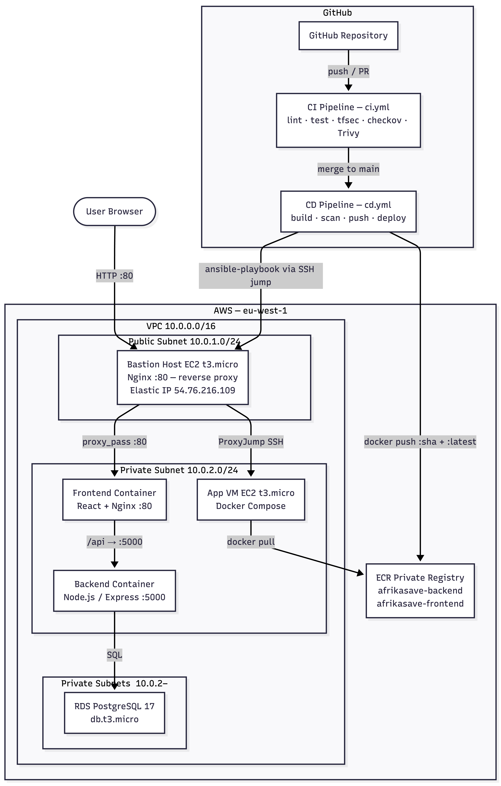

# AfrikaSave — Micro-Savings Hub

> Empowering Community Savings Across Africa

[](https://github.com/gloriaumutoni/micro-savings-hub/actions/workflows/ci.yml)
[](https://github.com/gloriaumutoni/micro-savings-hub/actions/workflows/cd.yml)
[](./LICENSE)

---

## Team Members

- **Gloria Umutoni** [@gloriaumutoni](https://github.com/gloriaumutoni) — Role: CI / Security
- **Josue Ahadi** [@josueahadi](https://github.com/josueahadi) — Role: Terraform / IaC
- **Chartine** [@Chartine02](https://github.com/Chartine02) — Role: Ansible / CD

---

## Live Application

[Access Live App](http://54.76.216.109)

> The Bastion Host's Nginx reverse-proxies port 80 to the App VM in the private subnet. The App VM has no public IP — all traffic enters through the bastion's Elastic IP.

| Endpoint | Description |
|---|---|
| `GET /health` | Backend liveness check |
| `POST /api/auth/register` | Create a new user account |
| `POST /api/auth/login` | Login and receive a JWT |
| `GET /api/groups` | List your savings groups (auth required) |
| `POST /api/groups` | Create a savings group (auth required) |

---

## Architecture Overview

### Architecture Diagram



### Component Description

**Bastion Host (EC2 t3.micro — public subnet)**
The single public entry point for both end-user traffic and operator SSH access. Nginx reverse-proxies HTTP port 80 to the App VM's private IP. All SSH sessions to the App VM jump through the bastion via `ProxyJump`.

**App VM (EC2 t3.micro — private subnet)**
Runs `docker-compose.prod.yml` with two containers: the React/Nginx frontend and the Node.js/Express backend. Has no public IP — reachable only via the bastion. An IAM instance profile grants it read-only ECR access so Docker can pull images without stored credentials.

**RDS PostgreSQL 17 (private subnets)**
Managed database spanning two private subnets (required by RDS subnet groups). Only the App VM's security group is allowed inbound on port 5432.

**ECR Private Registry**
Two repositories — `afrikasave-backend` and `afrikasave-frontend` — provisioned by Terraform with lifecycle policies. Images are tagged with the commit SHA for traceability and `:latest` for convenience.

**GitHub Actions CI/CD**
CI runs on every branch push and PR, blocking merge on any lint, test, or security failure. CD triggers on merge to `main`, re-runs all gates, pushes both images to ECR, then uses Ansible over SSH to deploy.

**Security controls in place**
- App VM and RDS are in private subnets with no internet-facing ports
- Security groups follow least-privilege: bastion accepts :80/:22 from anywhere; App VM accepts :80/:22 only from the bastion SG; RDS accepts :5432 only from the App VM SG
- All SSH access uses key-pair authentication — no passwords
- IAM instance profile on App VM: ECR read-only, no static credentials
- Secrets injected at runtime via GitHub Secrets — never stored in the repository
- Trivy, tfsec, and checkov block merge on HIGH/CRITICAL findings

---

## Technology Stack

- **Cloud Provider:** AWS (VPC, EC2, RDS, ECR, IAM, EIP, NAT Gateway)
- **Application:** Node.js 24 / Express 5 (backend), React 19 / Vite 7 / TypeScript (frontend)
- **Database:** PostgreSQL 17 (RDS)
- **Container Registry:** AWS ECR (private)
- **IaC:** Terraform ~> 1.14 (AWS provider ~> 6.0)
- **Config Management:** Ansible
- **CI/CD:** GitHub Actions
- **Security Scanning:** tfsec (Terraform), checkov (Terraform), Trivy (container images)
- **Reverse Proxy:** Nginx (bastion + frontend container)
- **Styling:** Tailwind CSS v4

---

## Repository Structure

```
micro-savings-hub/
├── .github/
│   ├── workflows/
│   │   ├── ci.yml                    # CI — lint, test, IaC scans, Trivy, GHCR push
│   │   └── cd.yml                    # CD — re-runs CI, pushes to ECR, deploys via Ansible
│   ├── ISSUE_TEMPLATE/
│   │   ├── bug_report.md
│   │   └── task.md
│   ├── CODEOWNERS
│   └── PULL_REQUEST_TEMPLATE.md
├── ansible/
│   ├── deploy.yml                    # Installs Docker/AWS CLI, ECR auth, docker compose up
│   └── inventory.ini                 # Bastion + App VM (IPs injected from secrets at deploy time)
├── terraform/
│   ├── main.tf                       # VPC, subnets, EC2 ×2, RDS, ECR ×2, IAM, SGs, EIP, NAT
│   ├── variables.tf                  # All configurable parameters with defaults
│   ├── outputs.tf                    # bastion_public_ip, app_vm_private_ip, ecr_*_url
│   ├── terraform.tfvars.example      # Copy → terraform.tfvars, never committed
│   └── README.md
├── backend/
│   ├── src/
│   │   ├── config/db.js              # PostgreSQL connection pool
│   │   ├── controllers/              # auth, groups, admin
│   │   ├── middleware/               # JWT auth, role guards, error handler
│   │   ├── routes/                   # auth, groups, admin
│   │   └── services/                 # Business logic + SQL queries
│   ├── db/init.sql                   # Schema — users, groups, members, contributions, goals
│   ├── tests/                        # Jest + Supertest integration tests
│   ├── Dockerfile                    # Multi-stage, non-root user, Alpine
│   ├── .env.example
│   └── package.json
├── frontend/
│   ├── src/
│   │   ├── components/
│   │   ├── pages/
│   │   ├── services/                 # Axios API client
│   │   └── types/
│   ├── nginx.conf                    # Proxies /api → backend container
│   ├── Dockerfile                    # Multi-stage Vite build + Nginx serve
│   └── package.json
├── docker-compose.yml                # Local dev: postgres + backend
├── docker-compose.prod.yml           # Production: pulls images from ECR
├── .trivyignore                      # Accepted CVE exceptions with justifications
├── .gitignore
├── LICENSE
└── README.md
```

---

## Setup Instructions

### Prerequisites

- **AWS account** with permissions to create VPC, EC2, RDS, ECR, and IAM resources
- **Terraform** >= 1.14 — [install guide](https://developer.hashicorp.com/terraform/install)
- **Ansible** >= 2.15 — `pip install ansible`
- **Docker** and Docker Compose (for local development)
- **Node.js 24+** and npm 10+ (for local development)
- An **SSH key pair** for EC2 access: `ssh-keygen -t ed25519 -f ~/.ssh/afrikasave-deploy`
- A **GitHub account** with access to this repository and permission to add secrets

### Deployment Steps

#### 1. Clone the repository

```bash
git clone https://github.com/gloriaumutoni/micro-savings-hub.git
cd micro-savings-hub
```

#### 2. Configure Terraform variables

```bash
cd terraform
cp terraform.tfvars.example terraform.tfvars
```

Edit `terraform.tfvars` — the two required values are:

```hcl
ssh_public_key = "ssh-ed25519 AAAA..."
db_password    = "change-me-to-a-strong-password"
```

#### 3. Initialise and apply Terraform

```bash
terraform init
terraform plan
terraform apply
```

Note the outputs — you will need them for GitHub Secrets:

```bash
terraform output bastion_public_ip
terraform output app_vm_private_ip
terraform output ecr_backend_url
terraform output ecr_frontend_url
```

The ECR registry hostname (everything before the first `/` in the ECR URL) goes into `ECR_REGISTRY`.

#### 4. Add GitHub Secrets

Go to **Settings → Secrets and variables → Actions → Secrets** and add:

| Secret | Value |
|---|---|
| `JWT_SECRET` | `node -e "console.log(require('crypto').randomBytes(64).toString('hex'))"` |
| `AWS_ACCESS_KEY_ID` | IAM deploy user key |
| `AWS_SECRET_ACCESS_KEY` | IAM deploy user secret |
| `ECR_REGISTRY` | `<account>.dkr.ecr.<region>.amazonaws.com` |
| `ECR_BACKEND_REPOSITORY` | e.g. `afrikasave-backend` |
| `ECR_FRONTEND_REPOSITORY` | e.g. `afrikasave-frontend` |
| `BASTION_HOST` | Bastion Elastic IP |
| `APP_VM_HOST` | App VM private IP |
| `SSH_PRIVATE_KEY` | Full contents of `~/.ssh/afrikasave-deploy` |
| `DATABASE_URL` | `postgresql://appuser:<password>@<rds_endpoint>:5432/micro_savings_hub` |
| `JWT_EXPIRES_IN` | `7d` |

Add one **variable** (not a secret) under **Settings → Secrets and variables → Actions → Variables**:

| Variable | Value |
|---|---|
| `AWS_REGION` | `eu-west-1` |

#### 5. Create the `production` GitHub Environment

Go to **Settings → Environments → New environment** and name it `production`. The CD deploy job is gated on this environment, allowing you to add manual approval reviewers if needed.

#### 6. Trigger the first deployment

```bash
git checkout -b feat/initial-deploy
git commit --allow-empty -m "ci: trigger initial CD deployment"
git push origin feat/initial-deploy
```

#### 7. Verify the deployment

```bash
curl http://54.76.216.109/health

ssh -J ubuntu@54.76.216.109 ubuntu@<APP_VM_PRIVATE_IP>
docker ps
docker compose -f /opt/afrikasave/docker-compose.prod.yml logs -f
```

### Local Development (without cloud)

```bash
cp backend/.env.example .env
docker compose up
```

In a separate terminal:

```bash
cd frontend && npm install && npm run dev
```

### Tearing Down

To cleanly destroy all AWS resources and avoid ongoing charges:

```bash
cd terraform
terraform destroy
```

This removes all EC2 instances, RDS, ECR repositories (and all images inside them), VPC, subnets, security groups, NAT gateway, and Elastic IPs. The action is **irreversible** — all data in RDS will be permanently deleted.

> **Tip:** run `terraform plan -destroy` first to preview everything that will be removed before confirming.

---

## CI/CD Pipeline

### CI Pipeline

- **Triggers on:** Push to any branch (except `main`) and Pull Requests targeting `main`
- **Steps:**

| Job | Steps |
|---|---|
| `backend` | `npm ci` → ESLint → apply schema → Jest tests → `/health` smoke test |
| `frontend` | `npm ci` → ESLint → `vite build` |
| `tfsec` | Scan `terraform/` for IaC misconfigurations — hard fail on any finding |
| `checkov` | Scan `terraform/` for policy violations — soft fail, results uploaded as artifact |
| `docker` | Build backend + frontend images → Trivy scan each → push to GHCR on pass |

- **Security scans:**
  - **tfsec** — detects Terraform misconfigurations (open security groups, unencrypted storage, public buckets, etc.)
  - **checkov** — policy-as-code checks against CIS benchmarks and AWS best practices
  - **Trivy** — scans Docker images for CVEs; blocks on HIGH or CRITICAL unfixed vulnerabilities; SARIF reports uploaded as artifacts

### CD Pipeline

- **Triggers on:** Push to `main` (i.e. when a PR is merged)
- **Concurrency:** `cancel-in-progress: false` — an in-flight deploy always finishes before the next starts, preventing partial states
- **Deployment process:**

```
merge to main
     │
     ├─► backend  (lint + test) ──┐
     ├─► frontend (lint + build)  ├──► build-and-push ──────────────► deploy
     ├─► tfsec                    │    1. Configure AWS credentials    1. Install Ansible
     └─► checkov ─────────────────┘    2. ECR login                   2. Write SSH key
                                       3. Build backend image          3. Generate inventory
                                       4. Trivy scan backend           4. Run ansible-playbook
                                       5. Push backend to ECR             - Install Docker
                                       6. Build frontend image            - Install AWS CLI
                                       7. Trivy scan frontend             - ECR auth (IAM)
                                       8. Push frontend to ECR            - Pull images
                                                                          - docker compose up -d
                                                                          - Health check
                                                                       5. Remove SSH key
```

---

## Security Measures

**Container image scanning — Trivy**
Every Docker image is scanned for CVEs before being pushed to any registry. The pipeline hard-fails on unfixed HIGH or CRITICAL vulnerabilities. Known accepted exceptions are documented in `.trivyignore` with justification comments.

**IaC scanning — tfsec and checkov**
All Terraform configuration is scanned on every CI run. tfsec hard-fails on misconfigurations (open security groups, unencrypted resources). checkov runs as soft-fail with results uploaded as pipeline artifacts for review.

**Network security — private subnet isolation**
The App VM and RDS instance live in private subnets with no internet-facing ports. Security group rules follow least-privilege:
- Bastion: accepts `:80` (Nginx) and `:22` (SSH) from `0.0.0.0/0`
- App VM: accepts `:80` and `:22` only from the Bastion security group
- RDS: accepts `:5432` only from the App VM security group

**IAM instance profile — no static credentials on the VM**
The App VM has an IAM instance profile with ECR read-only permissions. Docker authenticates to ECR using `aws ecr get-login-password` backed by the instance profile — no access keys are stored on the VM.

**Secret management — GitHub Secrets**
All sensitive values (database credentials, JWT secret, SSH private key, ECR coordinates) are stored as encrypted GitHub Secrets. They are injected as environment variables at runtime and never written to disk on the runner (except the SSH key, which is written to `~/.ssh/` and explicitly deleted with `if: always()` after the deploy job).

**SSH access — key-pair only, via bastion jump**
No password authentication. All SSH to the App VM goes through the bastion host using `ProxyJump`. `StrictHostKeyChecking=no` is used in the Ansible inventory to allow the ephemeral GitHub runner to connect without a pre-known `known_hosts` entry.

---

## Challenges & Solutions

**Challenge: RDS provisioning time in Terraform**
RDS instances take 10–15 minutes to become available, which exceeds what most developers expect from `terraform apply`. The initial `apply` appeared to hang.

_Solution:_ Added a note in the setup instructions and set appropriate `--timeout` expectations. Terraform's built-in polling handles it automatically — no custom workarounds needed.

**Challenge: App VM SSH through bastion in GitHub Actions**
The GitHub Actions runner has no pre-existing SSH trust with the bastion or App VM, and the App VM has no public IP, requiring a `ProxyJump` through the bastion.

_Solution:_ The deploy job writes the private key to `~/.ssh/afrikasave-deploy`, generates the inventory by substituting IPs from GitHub Secrets into `inventory.ini`, and uses the `ansible_ssh_common_args` in the inventory (which already includes the `ProxyCommand`) so no extra CLI flags are needed.

**Challenge: Ansible inventory using template placeholders**
`inventory.ini` uses `{{ BASTION_PUBLIC_IP }}` and `{{ APP_VM_PRIVATE_IP }}` as literal placeholders rather than real IPs, which vary per environment and must not be committed.

_Solution:_ The CD pipeline uses `sed` to replace the placeholders from GitHub Secrets at runtime, writing the result to `/tmp/inventory.ini` before running Ansible.

**Challenge: Docker image CVEs from base images**
Trivy flagged CVEs in the `node:24-alpine` and `nginx:1.28-alpine` base images that were upstream-unfixed, blocking CI.

_Solution:_ Added `RUN apk upgrade --no-cache` to both Dockerfiles to apply all available Alpine package security patches at build time. Truly unfixed CVEs with no available fix are added to `.trivyignore` with a comment and expiry date.

**Challenge: IPv6 resolution in GitHub Actions**
The backend tests failed to connect to the PostgreSQL service container because `localhost` resolved to `::1` (IPv6) in the GitHub Actions environment, but the Postgres container only listens on IPv4.

_Solution:_ Changed `DATABASE_URL` in the CI steps to use `127.0.0.1` explicitly instead of `localhost`.

---

## Video Demo

[Watch Demo Video](video-link)

---

## License

[MIT License](./LICENSE) — Copyright © 2026 Avengers
